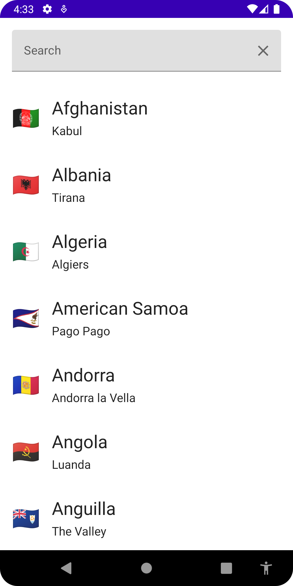
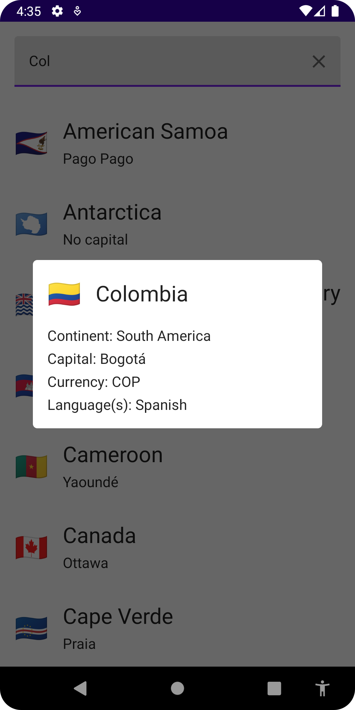

# GraphQL Countries App

This is a simple app that uses the [Countries GraphQL API](https://countries.trevorblades.com/) to display a list of countries and their details.


**Ref**
- [Apollo Android](https://www.apollographql.com/docs/kotlin)


## Download Schema

To [download the schema](https://www.apollographql.com/docs/kotlin/tutorial/02-add-the-graphql-schema), run the following command:

```bash
./gradlew :app:downloadApolloSchema --endpoint='https://countries.trevorblades.com/graphql' --schema=app/src/main/graphql/com/example/schema.graphqls
```

## Screenshots

| Countries                                 | Country Details                               |
|-------------------------------------------|-----------------------------------------------|
|  |  |